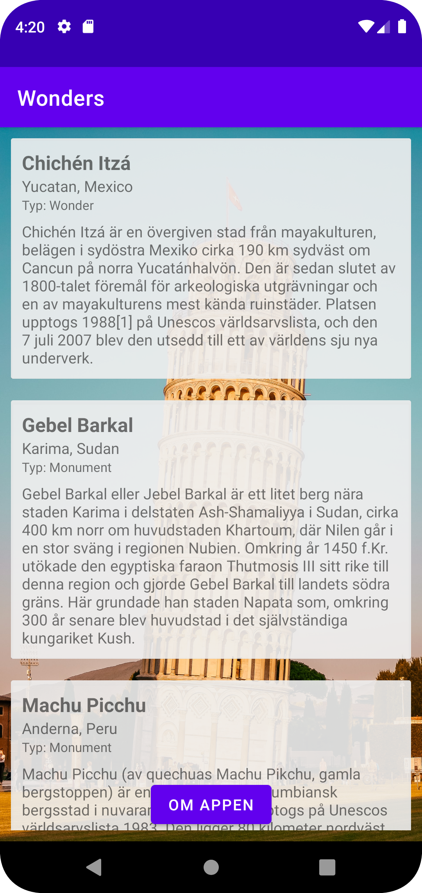
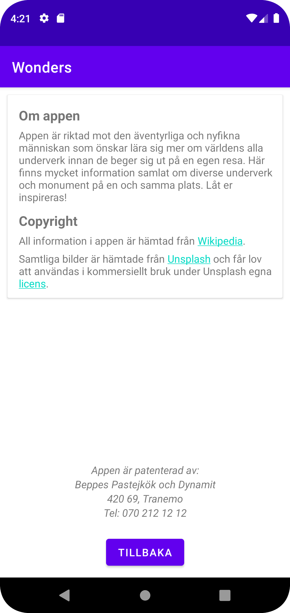

# Rapport

I detta projekt har jag skapat en egen applikation där användare kan läsa om några av världens monument och underverk.
Till mih hjälp har jag primärt använt mig av en recyclerView som visar information som hämtas från nätet via json och parsas med hjälp av gason.

Appen består av 3 aktiviteter: en frontpage/startsida, en huvudaktivitet och en about-aktivitet.
Framsidan består endast av en imageView och en textView samt en knapp som tar användaren till MainActivity när hen klckar på den.
Detta görs med hjälp av en onClickListener och intents:
```
button = findViewById(R.id.explore_button);
button.setOnClickListener(new View.OnClickListener() {
    @Override
    public void onClick(View view) {

        Intent intent = new Intent(WelcomePage.this, MainActivity.class);
        startActivity(intent);

    }
});
```

I mainActivity har vi recyclerViwen som skapas med hjäpl en recycleView, adapter och viewholder.
Nedan visas de variabler som kopplas till recyclerViewen och adaptern.
```
listOfWonders = new ArrayList<Wonder>();
adapter = new WonderAdapter();

recyclerView = findViewById(R.id.wonder_recycler);
recyclerView.setLayoutManager(new LinearLayoutManager(this));
recyclerView.setAdapter(adapter);
```

I adaptern kopplas holders till variablerna i viewHoldern, som i sin tur är en representation av gränssnittet fast i javakod.
Här nedan är det kodstycket ur adaptern:
```
public void onBindViewHolder(@NonNull WonderViewHolder holder, int position) {
    Wonder wonder = wonders.get(position);

    holder.name.setText(wonder.getName());
    holder.location.setText(wonder.getLocation());
    holder.category.setText("Typ: " + wonder.getCategory());
    holder.auxdata.setText(wonder.getAuxdata());
}
```
Och här nedan är stycket ur viewHoldern:
```
public WonderViewHolder(@NonNull View itemView) {
    super(itemView);

    name = itemView.findViewById(R.id.name);
    location = itemView.findViewById(R.id.location);
    category = itemView.findViewById(R.id.category);
    auxdata = itemView.findViewById(R.id.auxdata);
}
```

Längst ner i mainActivity finns en knapp som på samma sätt som knappen på startsidan tar användaren till about-aktiviteten.
I about-aktiviteten är information om appens målgrupp samlad i en cardview med en constraintLayout. I textsträngarna under strings.xml har jag skapat hyperlänkar som tar användaren till webbsidor när de klickar på dem.
För att det skulle funka var jag tvungen att använda mig av setMovementMethod-metoder på TextViewsen. Se nedan:
```
wikipedia = findViewById(R.id.wikipedia);
unsplash = findViewById(R.id.unsplash);
copyright = findViewById(R.id.copyright);

wikipedia.setMovementMethod(LinkMovementMethod.getInstance());
unsplash.setMovementMethod(LinkMovementMethod.getInstance());
copyright.setMovementMethod(LinkMovementMethod.getInstance());
```

Undertill finns bifogade skärmklipp som visar hur huvud- och about-aktiviteten ser ut.



